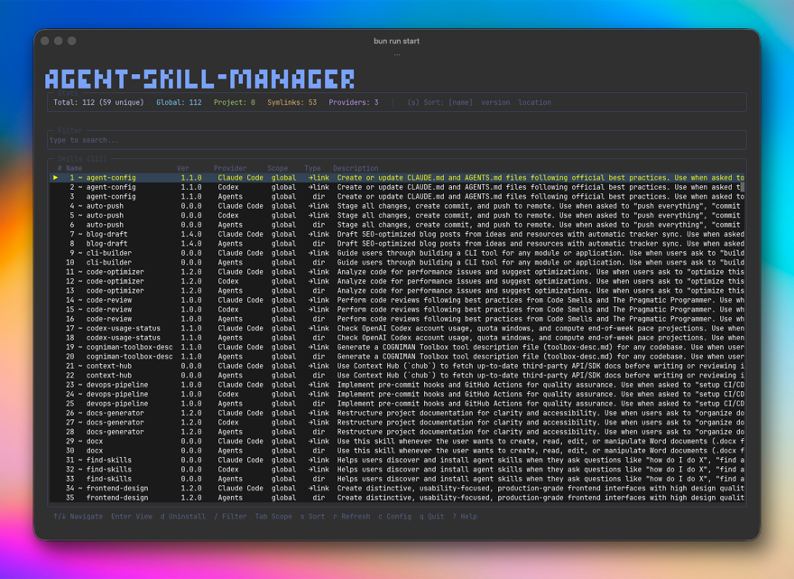

<p align="center">
  <picture>
    <source media="(prefers-color-scheme: dark)" srcset="assets/logo/logo-full.svg" />
    <source media="(prefers-color-scheme: light)" srcset="assets/logo/logo-black.svg" />
    
  </picture>
</p>

<p align="center">
  <em>The universal skill manager for AI coding agents.</em>
</p>

<p align="center">
  <a href="#features">Features</a> &middot;
  <a href="#install">Install</a> &middot;
  <a href="#usage">Usage</a> &middot;
  <a href="#configuration">Configuration</a> &middot;
  <a href="docs/">Docs</a> &middot;
  <a href="CONTRIBUTING.md">Contributing</a> &middot;
  <a href="LICENSE">License</a>
</p>

<p align="center">
  <a href="LICENSE"></a>
  <a href="https://bun.sh"></a>
  <a href="https://github.com/luongnv89/agent-skill-manager/actions"></a>
</p>

---

**agent-skill-manager** (`asm`) is an interactive TUI and CLI for managing installed skills across AI coding agents — [Claude Code](https://docs.anthropic.com/en/docs/claude-code), [Codex](https://github.com/openai/codex), [OpenClaw](https://github.com/openclaw), and more. Built with [OpenTUI](https://github.com/nicholasgasior/opentui) and [Bun](https://bun.sh).

<p align="center">
  
</p>

## Features

- **Dual interface** — Full interactive TUI and non-interactive CLI (`asm list`, `asm search`, etc.)
- **Multi-agent support** — Manage skills for Claude Code, Codex, OpenClaw, and custom agent tools from a single tool
- **Configurable providers** — Define which agent tool directories to scan via `~/.config/agent-skill-manager/config.json`
- **Global & project scopes** — Filter skills by global (`~/.<tool>/skills/`) or project-level (`./<tool>/skills/`)
- **Real-time search** — Filter skills by name, description, or provider
- **Sort** — By name, version, or location
- **Detailed skill view** — Metadata from SKILL.md frontmatter including provider, path, symlink info
- **Duplicate audit** — Detect and remove duplicate skills across providers and scopes
- **Safe uninstall** — Confirmation dialog, removes skill directories, rule files, and AGENTS.md blocks
- **In-TUI config editor** — Toggle providers on/off, or open config in `$EDITOR`
- **JSON output** — Machine-readable output for scripting (`--json`)

## Install

### Quick Install (one command)

```bash
curl -sSL https://raw.githubusercontent.com/luongnv89/agent-skill-manager/main/install.sh | bash
```

Or with wget:

```bash
wget -qO- https://raw.githubusercontent.com/luongnv89/agent-skill-manager/main/install.sh | bash
```

This will automatically install [Bun](https://bun.sh) (if not already installed) and then install `agent-skill-manager` globally.

### Manual Install

**Prerequisites:** [Bun](https://bun.sh) >= 1.0.0

```bash
bun install -g agent-skill-manager
```

### From Source

```bash
git clone https://github.com/luongnv89/agent-skill-manager.git
cd agent-skill-manager
bun install
bun run start
```

### Advanced Options

```bash
# Download and inspect before running
curl -sSL https://raw.githubusercontent.com/luongnv89/agent-skill-manager/main/install.sh -o install.sh
less install.sh  # review the script
bash install.sh
```

## Usage

### Interactive TUI

Launch without arguments to open the interactive terminal UI:

```bash
asm                    # or: agent-skill-manager
```

### CLI Commands

```bash
asm list                       # List all discovered skills
asm search <query>             # Search by name/description/provider
asm inspect <skill-name>       # Show detailed info for a skill
asm uninstall <skill-name>     # Remove a skill (with confirmation)
asm audit                      # Detect duplicate skills
asm config show                # Print current config
asm config path                # Print config file path
asm config reset               # Reset config to defaults
asm config edit                # Open config in $EDITOR
```

### Global Options

```
-h, --help             Show help for any command
-v, --version          Print version and exit
--json                 Output as JSON (list, search, inspect, audit)
-s, --scope <scope>    Filter: global, project, or both (default: both)
--sort <field>         Sort by: name, version, or location (default: name)
-y, --yes              Skip confirmation prompts
--no-color             Disable ANSI colors
```

### Examples

```bash
# List all global skills sorted by provider location
asm list --scope global --sort location

# Search for skills and output JSON
asm search "code review" --json

# Inspect a specific skill
asm inspect my-skill

# Remove duplicates automatically
asm audit --yes

# Uninstall without confirmation
asm uninstall old-skill --yes
```

## TUI Keyboard Shortcuts

| Key            | Action                                |
| -------------- | ------------------------------------- |
| `↑/↓` or `j/k` | Navigate skill list                   |
| `Enter`        | View skill details                    |
| `d`            | Uninstall selected skill              |
| `/`            | Search / filter skills                |
| `Esc`          | Back / clear filter / close dialog    |
| `Tab`          | Cycle scope: Global → Project → Both  |
| `s`            | Cycle sort: Name → Version → Location |
| `r`            | Refresh / rescan skills               |
| `c`            | Open configuration                    |
| `a`            | Audit duplicates                      |
| `q`            | Quit                                  |
| `?`            | Toggle help overlay                   |

## Configuration

On first run, a config file is created at `~/.config/agent-skill-manager/config.json` with default providers:

```json
{
  "version": 1,
  "providers": [
    {
      "name": "claude",
      "label": "Claude Code",
      "global": "~/.claude/skills",
      "project": ".claude/skills",
      "enabled": true
    },
    {
      "name": "codex",
      "label": "Codex",
      "global": "~/.codex/skills",
      "project": ".codex/skills",
      "enabled": true
    },
    {
      "name": "openclaw",
      "label": "OpenClaw",
      "global": "~/.openclaw/skills",
      "project": ".openclaw/skills",
      "enabled": true
    },
    {
      "name": "agents",
      "label": "Agents",
      "global": "~/.agents/skills",
      "project": ".agents/skills",
      "enabled": true
    }
  ],
  "customPaths": [],
  "preferences": {
    "defaultScope": "both",
    "defaultSort": "name"
  }
}
```

- **Add providers** — Add new entries to the `providers` array for any agent tool
- **Custom paths** — Add arbitrary directories via `customPaths`
- **Disable providers** — Set `enabled: false` to skip scanning a provider
- **Preferences** — Set default scope and sort order

You can also manage config from the CLI (`asm config show|path|reset|edit`) or toggle providers in the TUI by pressing `c`.

## Supported Agent Tools

| Tool             | Global Path           | Project Path        |
| ---------------- | --------------------- | ------------------- |
| Claude Code      | `~/.claude/skills/`   | `.claude/skills/`   |
| Codex            | `~/.codex/skills/`    | `.codex/skills/`    |
| OpenClaw         | `~/.openclaw/skills/` | `.openclaw/skills/` |
| Agents (generic) | `~/.agents/skills/`   | `.agents/skills/`   |

Additional tools can be added via the config file.

## Project Structure

```
agent-skill-manager/
├── bin/                       # CLI entry point
│   └── agent-skill-manager.ts
├── src/
│   ├── index.ts               # TUI app bootstrap & keyboard handling
│   ├── cli.ts                 # CLI command parser & dispatcher
│   ├── config.ts              # Config loading & saving
│   ├── scanner.ts             # Skill directory scanning & filtering
│   ├── auditor.ts             # Duplicate detection & reporting
│   ├── uninstaller.ts         # Safe skill removal logic
│   ├── formatter.ts           # Output formatting (tables, detail, JSON)
│   ├── utils/
│   │   ├── types.ts           # Shared TypeScript types
│   │   ├── colors.ts          # TUI color palette
│   │   ├── version.ts         # Version constant
│   │   └── frontmatter.ts     # SKILL.md frontmatter parser
│   └── views/
│       ├── dashboard.ts       # Main dashboard layout
│       ├── skill-list.ts      # Scrollable skill list
│       ├── skill-detail.ts    # Skill detail overlay
│       ├── confirm.ts         # Uninstall confirmation dialog
│       ├── duplicates.ts      # Duplicate audit overlay
│       ├── config.ts          # In-TUI config editor
│       └── help.ts            # Help overlay
├── docs/                      # Extended documentation
│   ├── ARCHITECTURE.md        # System design & data flow
│   ├── DEVELOPMENT.md         # Local setup & debugging
│   ├── DEPLOYMENT.md          # Publishing & CI pipeline
│   ├── CHANGELOG.md           # Version history
│   └── brand_kit.md           # Logo, colors, typography
├── assets/
│   ├── logo/                  # SVG logos (full, mark, wordmark, icon, favicon)
│   └── screenshots/           # TUI screenshots
├── install.sh                 # One-command installer (curl | bash)
├── package.json
├── tsconfig.json
└── README.md
```

## Tech Stack

- **Runtime:** [Bun](https://bun.sh) >= 1.0.0
- **Language:** TypeScript (ESNext, strict mode)
- **TUI Framework:** [OpenTUI](https://github.com/nicholasgasior/opentui)
- **Testing:** Bun test runner
- **CI:** GitHub Actions + pre-commit hooks

## Documentation

| Document                              | Description                              |
| ------------------------------------- | ---------------------------------------- |
| [Architecture](docs/ARCHITECTURE.md)  | System design, components, and data flow |
| [Development](docs/DEVELOPMENT.md)    | Local setup, testing, and debugging      |
| [Deployment](docs/DEPLOYMENT.md)      | Publishing and CI pipeline               |
| [Changelog](docs/CHANGELOG.md)        | Version history                          |
| [Brand Kit](docs/brand_kit.md)        | Logo, colors, and typography             |
| [Contributing](CONTRIBUTING.md)       | How to contribute                        |
| [Security](SECURITY.md)               | Vulnerability reporting                  |
| [Code of Conduct](CODE_OF_CONDUCT.md) | Community guidelines                     |

## Contributing

Contributions are welcome! See [CONTRIBUTING.md](CONTRIBUTING.md) for guidelines.

## License

[MIT](LICENSE) — see the [LICENSE](LICENSE) file for details.
