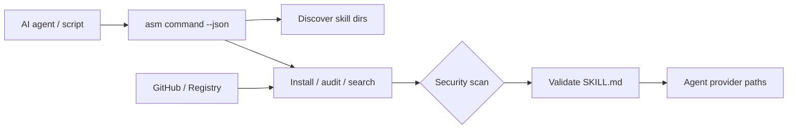
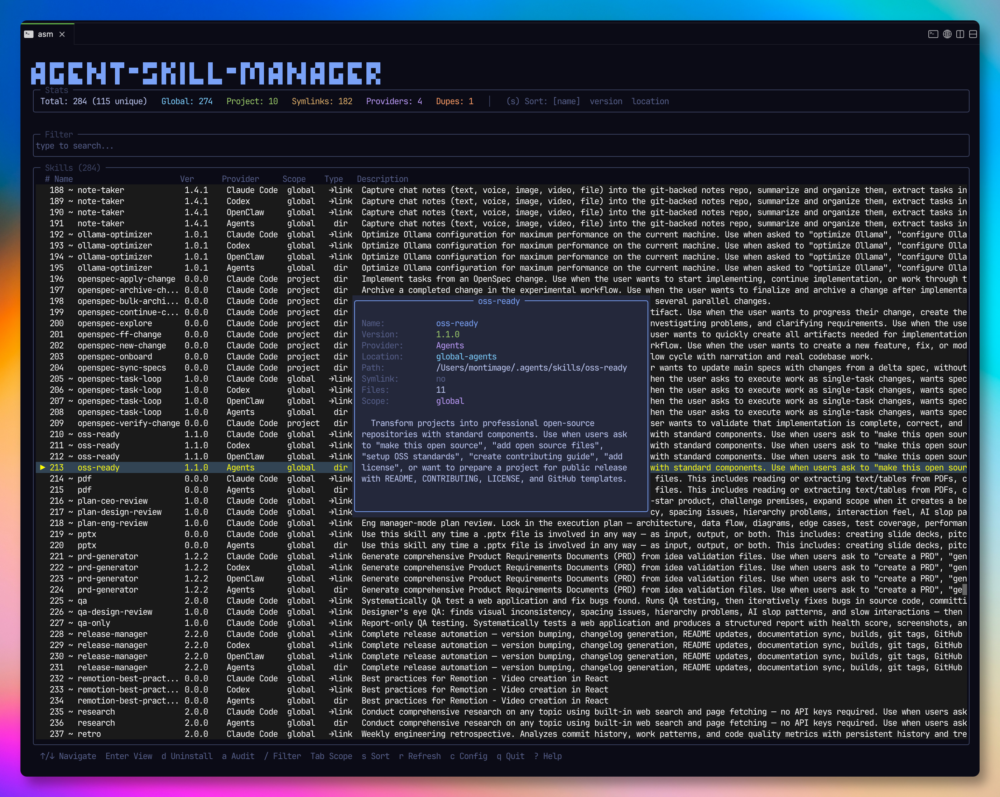

<p align="center">
  <picture>
    <source media="(prefers-color-scheme: dark)" srcset="assets/logo/logo-full.svg" />
    <source media="(prefers-color-scheme: light)" srcset="assets/logo/logo-black.svg" />
    
  </picture>
</p>

<p align="center">
  <a href="https://www.npmjs.com/package/agent-skill-manager"></a>
  <a href="https://www.npmjs.com/package/agent-skill-manager"></a>
  <a href="https://github.com/luongnv89/asm/stargazers"></a>
  <a href="LICENSE"></a>
  <a href="https://github.com/luongnv89/asm/actions"></a>
  <a href="https://nodejs.org"></a>
</p>

# CLI to install and manage agent skills

**agent-skill-manager** (`asm`) is a scriptable CLI built for AI agents and automation — install, search, audit, and organize skills across Claude Code, Codex, Cursor, and 16 more tools. Every command supports `--json` and `--yes` for non-interactive use. An optional TUI (`asm`) is available for local browsing.

[**Get Started**](#getting-started) · [**Browse 4,300+ skills**](https://luongnv.com/asm/#/skills) · [**Full docs**](#documentation)

## Problems `asm` solves

| Pain                      | Without `asm`                                                                                                           | With `asm`                                                                 |
| ------------------------- | ----------------------------------------------------------------------------------------------------------------------- | -------------------------------------------------------------------------- |
| Scattered installs        | Same skill copied into `~/.claude/skills/`, `~/.codex/skills/`, `~/.cursor/rules/` — different versions, no single view | One `asm list` across all 19 providers and scopes                          |
| No inventory              | `ls` through hidden dirs; no idea what is installed, duplicated, or outdated                                            | `asm search`, `asm inspect`, `asm stats`, `asm audit`                      |
| Invisible context cost    | Every installed skill's description is resident in the agent's prompt on every message, whether or not it ever fires    | `asm stats --tokens`, `asm audit residency`                                |
| Install just to read once | Installing is the only way to get a skill in front of an agent — and it stays resident forever afterwards               | `asm get <skill>` prints the body and installs nothing                     |
| Risky manual installs     | Clone repos, copy folders, hope `SKILL.md` is valid                                                                     | `asm install` validates frontmatter, scans security, pins registry commits |
| Agent-unfriendly output   | Human-only copy-paste workflows                                                                                         | Structured JSON via `--json`; skip prompts with `--yes`                    |
| New agent, new chore      | Every tool adds another skill directory to track                                                                        | Add or disable providers in one config file                                |

## At a glance

|                     |                                                                                |
| ------------------- | ------------------------------------------------------------------------------ |
| **Catalog**         | 4,394 skills from 54 repos — [browse online](https://luongnv.com/asm/#/skills) |
| **Providers**       | 19 agents (Claude, Codex, Cursor, Windsurf, Copilot, …)                        |
| **Agent-ready CLI** | `--json`, `--yes`, `--machine` on list, search, install, audit, eval           |
| **Security**        | Pre-install scan for shell exec, network access, credential exposure           |
| **License**         | MIT — no accounts, no telemetry                                                |

## How it works


```mermaid
graph LR
    A[AI agent / script] --> B["asm command --json"]
    B --> C[Discover skill dirs]
    B --> D[Install / audit / search]
    D --> E{Security scan}
    E --> F[Validate SKILL.md]
    F --> G[Agent provider paths]
    H[GitHub / Registry] --> D
```

1. Install `asm` once (npm or curl).
2. Run commands from your agent, shell, or CI — no prompts when you pass `--yes`.
3. Parse JSON output to decide what to install, remove, or audit next.

## Screenshots

<p align="center">
  
  <br/><em>The optional TUI (<code>asm</code> with no args) — filter, inspect, and audit skills across every provider from one dashboard.</em>
</p>

## Features

| Feature                  | What you get                                                         |
| ------------------------ | -------------------------------------------------------------------- |
| Cross-provider inventory | `asm list --json` — every skill, every agent, one response           |
| One-command install      | `asm install github:user/repo` or `asm install skill-name`           |
| Agent-parseable output   | `--json` on list, search, inspect, install, audit                    |
| Duplicate audit          | `asm audit --yes` removes redundant skills non-interactively         |
| Attention budget         | `asm stats --tokens` shows resident vs body token cost per tool      |
| Residency audit          | `asm audit residency` ranks skills to demote out of resident context |
| Reference tier           | `asm get <skill>` delivers a body once, at zero residency            |
| Security scan            | `asm audit security` before install                                  |
| Authoring pipeline       | `asm init`, `asm link`, `asm eval`, `asm publish`                    |
| Bundles                  | `asm bundle install` — curated sets in one pass                      |
| Local library            | `asm install --library` — install once, `asm activate` per provider  |
| Cross-tool linking       | Reinstall or symlink when a skill already exists in another tool     |

## Getting started

Install (npm):

```bash
npm install -g agent-skill-manager
```

List installed skills (JSON for agents):

```bash
asm list --json
```

Install a skill:

```bash
asm install github:anthropics/skills --yes
```

Search installed and catalog skills:

```bash
asm search "code review" --json
```

Alternative install: `curl -sSL https://raw.githubusercontent.com/luongnv89/asm/main/install.sh | bash`

Node.js 18+ required. Optional TUI: run `asm` with no arguments.

## Common tasks

| Task                          | Command                                          |
| ----------------------------- | ------------------------------------------------ |
| Machine-readable inventory    | `asm list --json`                                |
| Skill metadata for agents     | `asm inspect my-skill --json`                    |
| Non-interactive install       | `asm install code-review -p claude --yes --json` |
| Remove duplicates             | `asm audit --yes`                                |
| See your context cost         | `asm stats --tokens`                             |
| Find skills to demote         | `asm audit residency`                            |
| Use a skill without residency | `asm get code-review`                            |
| Scan before install           | `asm audit security github:user/repo`            |
| Scaffold a new skill          | `asm init my-skill -p claude`                    |
| Live dev via symlink          | `asm link ./my-skill -p claude`                  |
| Publish to registry           | `asm publish ./my-skill --yes`                   |
| Install a bundle              | `asm bundle install frontend-dev --yes`          |

Full command reference, flags, and examples: [CLI Commands](#cli-commands). Catalog UI and bundles: [luongnv.com/asm](https://luongnv.com/asm/).

## Attention budget

Disk is cheap; context is not. Every installed skill's frontmatter
`description` sits in the agent's system prompt on **every message**, whether or
not the skill ever fires. The full `SKILL.md` body only costs anything when the
skill actually fires.

`asm` reports the two separately — token counts are estimates and always render
with a leading `~`:

```bash
asm stats --tokens            # resident vs body tokens, per tool and per scope
asm stats --tokens --json     # same data for scripts and agents
```

```text
  Attention Budget
  ----------------------------------------

  Resident = frontmatter descriptions, paid on every message.
  Bodies   = full SKILL.md, paid only when a skill fires.

  Tool         Skills      Resident  Bodies
  Claude Code      74    ~5k tokens  ~281k tokens
  Codex            10   ~736 tokens  ~76k tokens
  ---------------------------------------------
  Total            84  ~5.7k tokens  ~357k tokens

  By Scope
  global           71  ~4.9k tokens  ~300k tokens
  project          13   ~836 tokens  ~57k tokens

  Heaviest resident descriptions
    claude-api       ~1.2k tokens  (claude, global)
    docx              ~233 tokens  (claude, global)
    pptx              ~217 tokens  (claude, global)
    code-review       ~198 tokens  (claude, global)
    frontend-design   ~176 tokens  (claude, project)
    dataviz           ~164 tokens  (claude, global)
    skill-creator     ~151 tokens  (claude, global)
    xlsx              ~143 tokens  (claude, global)
    pdf               ~138 tokens  (claude, global)
    release-manager   ~129 tokens  (codex, global)

  Median resident cost: ~48 tokens
  Run asm audit residency for demotion advice
```

### Residency audit

`asm audit residency` ranks the installed skills that are not earning their
resident context and pairs each one with a command that works for how that
skill is actually installed. It only reports — nothing is deactivated,
disabled, or removed unless you run one of the suggested commands yourself.

```bash
asm audit residency
asm audit residency --json
```

The advice assumes this demotion ladder:

| Tier                      | `asm` mechanism                           | Residency                    |
| ------------------------- | ----------------------------------------- | ---------------------------- |
| Installed (auto-triggers) | provider directory / `asm activate`       | description resident, always |
| Saved (adapt, no trigger) | `asm install --library`, `asm deactivate` | none until `asm activate`    |
| Disabled (kept on disk)   | `asm disable` (reverse with `asm enable`) | none                         |
| Reference (read on use)   | `asm get` — nothing on disk at all        | none                         |

Which command a candidate gets depends on how it is installed. `asm deactivate`
only works on a live symlink into the `asm` library, so it is suggested only
there; everything else gets `asm disable`, which is universal and reversible.
The `asm deactivate` path additionally gets `asm get <skill>` as a second
destination: deactivating removes the provider symlink but leaves the library
copy, so the body is still one command away. The `asm disable` path does not,
because disabling renames the canonical `SKILL.md` — for a library-linked skill
that is the library copy itself — leaving nothing for `asm get` to read.
Skills provided by plugin marketplaces are counted in the totals but never
listed as candidates — no `asm` command demotes them.

Two of the signals the report would like to use — trigger collision and
last-used counts — have no data source in `asm` yet. They are listed as
unavailable rather than silently dropped, so the report still works today.

No network calls, accounts, or telemetry are involved: both reports run
entirely against your local filesystem.

### Reference tier: use a skill without installing it

Demoting a skill does not mean losing it. `asm get <skill>` resolves a skill and
writes its `SKILL.md` body to **stdout** — no provider directory, no library
entry, no residency. The skill is paid for once, at the point of use, and costs
nothing afterwards.

```bash
asm get code-review                       # body to stdout
asm get code-review > /tmp/SKILL.md       # save it without installing
asm get github:owner/repo:skills/review   # any `asm install` shorthand
asm get code-review --json                # name, description, tier, source, tokenCount, security, content
```

That makes `asm` usable as delivery infrastructure, not only as an installer.
An agent can pull a skill in for a single task and drop it again:

```bash
asm get code-review | your-agent --system-prompt-file -
```

`<skill>` walks a resolution ladder, and the rung that answered is reported as
the `tier` so provenance is always visible:

| Order | Tier        | Resolves                                              |
| ----- | ----------- | ----------------------------------------------------- |
| 1     | `installed` | a skill already installed in one of your agents       |
| 2     | `library`   | a library skill, **including deactivated ones**       |
| 3     | `index`     | an indexed catalog skill, matched by exact name       |
| 4     | `registry`  | the ASM registry — same route as `asm install <name>` |

An explicit `github:owner/repo[#ref][:path]` shorthand, a GitHub URL, or a local
path skips the ladder. A name that matches more than one indexed repo or
registry author is never guessed: `asm get` exits non-zero and lists the
qualified candidates.

The catalog stores metadata, not bodies, so an `index`, `registry` or remote
`asm get` costs a shallow clone into a temp directory, which is deleted before
the command returns. Those fetches run the **same pre-install security scan
`asm install` runs**; the verdict goes to stderr and into `--json` under
`security`. It reports rather than blocks — `asm get` writes nothing — and
`--audit` prints the full `asm audit security` report for the fetched skill.

Output discipline: stdout carries the body (or, with `--json`, a single JSON
object) and nothing else, so piping and redirecting are safe. Provenance,
progress, and the security verdict go to stderr.

## FAQ

**Is it free?**
MIT licensed. No accounts or paywalls.

**Is this built for AI agents?**
Yes. Commands return structured JSON (`--json`), accept non-interactive flags (`--yes`, `--machine`), and map to discrete actions an agent can chain — list inventory, search catalog, install, audit, uninstall.

**Which agents are supported?**
19 providers: Claude Code, Codex, OpenClaw, Cursor, Windsurf, Cline, Roo Code, Continue, GitHub Copilot, Aider, OpenCode, Zed, Augment, Amp, Gemini CLI, Google Antigravity, Pi, Hermes, and a generic Agents provider. Disable any via `asm config edit`.

**What about the TUI?**
Run `asm` with no args for an optional local browser. The CLI is the primary interface for scripts, CI, and agent tool calls.

**Private repos?**
`asm install github:user/repo --transport ssh --yes`

**SKILL.md format?**
A directory with `SKILL.md` (YAML frontmatter + markdown body). Run `asm init my-skill` to scaffold one.

## Get started

```bash
npm install -g agent-skill-manager
```

```bash
asm list --json
```

[**Browse catalog**](https://luongnv.com/asm/#/skills) · [**Documentation**](#documentation) · [**Contributing**](CONTRIBUTING.md) · MIT Licensed

---

<details>
<summary><strong>Build, test, and ship skills</strong></summary>

### Scaffold

```bash
asm init my-skill
```

```bash
asm init my-skill -p claude
```

```bash
asm init my-skill --path ./skills
```

### Develop with live reload

```bash
asm link ./my-skill -p claude
```

```bash
asm link ./skill-a ./skill-b ./skill-c -p claude
```

```bash
asm link ./my-skills-folder -p claude
```

```bash
asm link ./my-skill --name my-alias -p claude --force
```

### Audit and inspect

```bash
asm audit security my-skill
```

```bash
asm audit security ./path/to/my-skill
```

```bash
asm audit security --all
```

```bash
asm inspect my-skill
```

```bash
asm inspect my-skill --json
```

### Test install flow

```bash
asm install github:you/awesome-skill
```

```bash
asm install github:you/awesome-skill -p claude --force --yes --json
```

### Publish to ASM Registry

```bash
asm publish ./my-skill
```

```bash
asm publish --dry-run ./my-skill
```

Requires [`gh` CLI](https://cli.github.com) authenticated with `gh auth login`.

### Typical workflow

1. `asm init awesome-skill -p claude`
2. Edit `SKILL.md`
3. `asm link ./awesome-skill -p claude`
4. Test with your agent
5. `asm audit security awesome-skill`
6. `asm inspect awesome-skill`
7. `asm eval ./awesome-skill`
8. Push to GitHub
9. `asm install github:you/awesome-skill`
10. `asm publish ./awesome-skill`

</details>

<details>
<summary><strong>Skill verification and quality eval</strong></summary>

Indexed skills are evaluated automatically. Skills passing all criteria get a **verified** badge in the catalog.

**Verification criteria (all required):**

1. Valid frontmatter with `name` and `description`
2. Body content with at least 20 characters of instruction text
3. No malicious patterns (`atob()`, suspicious base64, hex escapes, hardcoded credentials)
4. Directory contains a readable `SKILL.md`

```bash
asm index ingest github:your-user/your-repo
```

```bash
asm index search "your-skill" --json
```

**Quality scoring** (`asm eval`) runs a rubric over structure, clarity, safety, and naming:

```bash
asm eval ./my-skill
```

```bash
asm eval ./my-skill --machine
```

```bash
asm eval ./my-skill --fix
```

```bash
asm eval-providers list
```

See [`docs/eval-providers.md`](./docs/eval-providers.md) for the provider model.

</details>

<details>
<summary><strong>ASM Registry</strong></summary>

The [ASM Registry](https://github.com/luongnv89/asm-registry) lists community-published skills. Install by name — no GitHub URL needed.

```bash
asm install code-review
```

```bash
asm install luongnv89/code-review
```

```bash
asm install code-review --no-cache
```

```bash
asm publish ./my-skill
```

| Flag        | Description                              |
| ----------- | ---------------------------------------- |
| `--dry-run` | Preview manifest without creating a PR   |
| `--force`   | Override warning-level security findings |
| `--yes`     | Skip confirmation                        |
| `--machine` | JSON output                              |

**Resolution flow:** fetch index (1-hour cache) → find manifest with pinned commit → clone at exact commit → install.

</details>

<details>
<summary><strong>Open-source skill collections</strong></summary>

Over **2,800 skills** across curated repositories. Use `asm search <term>` to discover, then `asm install github:owner/repo`.

> Last updated: 2026-07-07

| Repository                                                                          | Description                                     |  Stars | Skills |
| ----------------------------------------------------------------------------------- | ----------------------------------------------- | -----: | -----: |
| [anthropic-skills](https://github.com/anthropics/skills)                            | Official Agent Skills from Anthropic            | 95,957 |     18 |
| [superpowers](https://github.com/obra/superpowers)                                  | Agentic skills framework                        | 89,816 |     14 |
| [everything-claude-code](https://github.com/affaan-m/everything-claude-code)        | Performance optimization for Claude Code, Codex | 81,392 |    183 |
| [agency-agents](https://github.com/msitarzewski/agency-agents)                      | Specialized expert agents                       | 50,749 |      — |
| [ui-ux-pro-max-skill](https://github.com/nextlevelbuilder/ui-ux-pro-max-skill)      | Design intelligence for UI/UX                   | 43,112 |      7 |
| [antigravity-awesome-skills](https://github.com/sickn33/antigravity-awesome-skills) | 1,000+ skills for Claude Code, Cursor           | 25,047 |  1,322 |
| [marketingskills](https://github.com/coreyhaines31/marketingskills)                 | Marketing — CRO, SEO, growth                    | 14,099 |     33 |
| [agentskills](https://github.com/agentskills/agentskills)                           | Agent Skills specification                      | 13,342 |      — |
| [claude-skills](https://github.com/alirezarezvani/claude-skills)                    | 192 skills across engineering, marketing        |  7,434 |    451 |
| [taste-skill](https://github.com/Leonxlnx/taste-skill)                              | Stops generic AI output                         |  3,389 |      7 |
| [affiliate-skills](https://github.com/Affitor/affiliate-skills)                     | Affiliate marketing funnel                      |     99 |     48 |
| [skills](https://github.com/luongnv89/skills)                                       | Reusable agent skills                           |      1 |     35 |

```bash
asm install github:anthropics/skills
```

```bash
asm install github:anthropics/skills --all
```

</details>

<details>
<summary><strong>Supported agent tools</strong></summary>

19 built-in providers, all enabled by default. Disable via `asm config edit`.

| Tool               | Global Path                       | Project Path            |
| ------------------ | --------------------------------- | ----------------------- |
| Claude Code        | `~/.claude/skills/`               | `.claude/skills/`       |
| Codex              | `~/.codex/skills/`                | `.codex/skills/`        |
| OpenClaw           | `~/.openclaw/skills/`             | `.openclaw/skills/`     |
| Agents (generic)   | `~/.agents/skills/`               | `.agents/skills/`       |
| Cursor             | `~/.cursor/rules/`                | `.cursor/rules/`        |
| Windsurf           | `~/.windsurf/rules/`              | `.windsurf/rules/`      |
| Cline              | `~/Documents/Cline/Rules/`        | `.clinerules/`          |
| Roo Code           | `~/.roo/rules/`                   | `.roo/rules/`           |
| Continue           | `~/.continue/rules/`              | `.continue/rules/`      |
| GitHub Copilot     | `~/.github/instructions/`         | `.github/instructions/` |
| Aider              | `~/.aider/skills/`                | `.aider/skills/`        |
| OpenCode           | `~/.config/opencode/skills/`      | `.opencode/skills/`     |
| Zed                | `~/.config/zed/prompt_overrides/` | `.zed/rules/`           |
| Augment            | `~/.augment/rules/`               | `.augment/rules/`       |
| Amp                | `~/.amp/skills/`                  | `.amp/skills/`          |
| Gemini CLI         | `~/.gemini/skills/`               | `.gemini/skills/`       |
| Google Antigravity | `~/.antigravity/skills/`          | `.antigravity/skills/`  |
| Pi                 | `~/.pi/skills/`                   | `.pi/skills/`           |
| Hermes             | `~/.hermes/skills/`               | `.hermes/skills/`       |

Add custom providers in config.

</details>

<details>
<summary><strong>Troubleshooting: shadowed installs</strong></summary>

Multiple `asm` binaries on `PATH` can shadow a fresh upgrade.

**Diagnose:** `asm --version` warns about multiple binaries. Run `asm doctor` for a full report.

**Fix:** Remove the stale install with your package manager, then confirm with `asm --version`.

</details>

<details id="cli-commands">
<summary><strong>CLI Commands</strong></summary>

### Commands

| Command                         | Description                               |
| ------------------------------- | ----------------------------------------- | ----------------------------------------- |
| `asm list`                      | List all discovered skills                |
| `asm search <query>`            | Search by name/description/provider       |
| `asm inspect <skill-name>`      | Show detailed info for a skill            |
| `asm get <skill>`               | Print a skill's body, install nothing     |
| `asm install <source>`          | Install from GitHub or registry           |
| `asm publish [path]`            | Publish to ASM Registry                   |
| `asm uninstall <skill-name>`    | Remove a skill                            |
| `asm init <name>`               | Scaffold a new skill                      |
| `asm link <path> [<path2> ...]` | Symlink skills for live dev               |
| `asm audit`                     | Detect duplicate skills                   |
| `asm audit security <name>`     | Security audit                            |
| `asm audit residency`           | Rank skills that do not earn residency    |
| `asm eval <skill>`              | Score skill quality                       |
| `asm eval-providers list`       | List eval providers                       |
| `asm stats`                     | Aggregate installed skill metrics         |
| `asm stats --tokens`            | Attention budget: resident vs body tokens |
| `asm stats repo <repo>`         | Per-repo indexed skill stats              |
| `asm stats author <owner>`      | Per-author indexed skill stats            |
| `asm stats index`               | Indexed catalog stats summary             |
| `asm activate <skill>`          | Link a library skill into a provider      |
| `asm deactivate <skill>`        | Remove a library activation symlink       |
| `asm library list               | update`                                   | Manage centrally installed library skills |
| `asm export`                    | Export inventory as JSON                  |
| `asm index ingest <repo>`       | Index a skill repo                        |
| `asm index search <query>`      | Search indexed skills                     |
| `asm index list`                | List indexed repos                        |
| `asm index remove <owner/repo>` | Remove repo from index                    |
| `asm bundle list`               | List bundles (`--predefined`)             |
| `asm bundle install <name>`     | Install every skill in a bundle           |
| `asm bundle create <name>`      | Create bundle from installed skills       |
| `asm bundle show <name>`        | Show bundle details                       |
| `asm bundle modify <name>`      | Add/remove skills                         |
| `asm bundle export <name>`      | Export bundle to JSON                     |
| `asm bundle remove <name>`      | Remove saved bundle                       |
| `asm config show`               | Print config                              |
| `asm config path`               | Print config path                         |
| `asm config reset`              | Reset to defaults                         |
| `asm config edit`               | Open config in `$EDITOR`                  |

### Global options

```text
-h, --help             Show help
-v, --version          Print version
--json                 JSON output
-s, --scope <scope>    global, project, or both
--sort <field>         name, version, or location
--model-invocable      Only skills the model can invoke
--user-invocable       Only skills the user can invoke
-y, --yes              Skip confirmations
--no-color             Disable ANSI colors
```

### Examples

```bash
asm list --scope global --sort location
```

```bash
asm list --summary
```

```bash
asm list --compact --group-by tool --limit 20
```

```bash
asm list --model-invocable --user-invocable
```

Listings and `asm inspect` show invocability as `model`, `user`, or `both` (never collapsed). `--model-invocable` and `--user-invocable` are independent; both flags keep skills that match both (typically `both`).

```bash
asm search "code review" --json
```

```bash
asm audit --yes
```

```bash
asm audit security github:user/repo
```

```bash
asm audit security --all
```

```bash
asm stats --tokens
```

```bash
asm audit residency --json
```

```bash
asm eval ./my-skill
```

```bash
asm init my-skill -p claude
```

```bash
asm link ./my-skill -p claude
```

```bash
asm uninstall old-skill --yes
```

```bash
asm index ingest github:anthropics/skills
```

```bash
asm index search "frontend design" --json
```

**Bundles** — pre-defined sets for common workflows. Browse at [luongnv.com/asm/#/bundles](https://luongnv.com/asm/#/bundles):

```bash
asm bundle list --predefined
```

```bash
asm bundle install frontend-dev
```

```bash
asm bundle install ./my-bundle.json
```

```bash
asm bundle create my-workflow
asm bundle export my-workflow ./my-workflow.json
```

**iOS/Swift catalog:** ASM indexes public Swift/Apple skill repos. Use `asm bundle install ios-release` or search for `swift`, `swiftui`, `swift testing`, `uikit`, `swiftdata`, `app store connect`.

</details>

<details>
<summary><strong>Installing skills from GitHub</strong></summary>

**Single-skill repo:**

```bash
asm install github:user/my-skill
```

```bash
asm install github:user/my-skill#v1.0.0 -p claude
```

**Multi-skill repo:**

```bash
asm install github:user/skills --path skills/code-review
```

```bash
asm install github:user/skills --all -p claude -y
```

**Subfolder URL:**

```bash
asm install https://github.com/user/skills/tree/main/skills/agent-config
```

```bash
asm install github:user/skills#main:skills/agent-config
```

**Private repos:**

```bash
asm install github:user/private-skill --transport ssh
```

```bash
asm install github:user/private-skill -t auto
```

**Vercel skills CLI:**

```bash
asm install github:user/skills --method vercel --skill my-skill
```

| Flag                     | Description                    |
| ------------------------ | ------------------------------ |
| `-p, --tool <name>`      | Target agent                   |
| `--name <name>`          | Override directory name        |
| `--path <subdir>`        | Install from subdirectory      |
| `--all`                  | Install all skills in repo     |
| `-m, --method <method>`  | `default` or `vercel`          |
| `-t, --transport <mode>` | `https`, `ssh`, or `auto`      |
| `--library`              | Install into the local library |
| `-f, --force`            | Overwrite existing             |
| `-y, --yes`              | Skip confirmation              |
| `--json`                 | JSON output                    |

Multi-skill repos: scans up to 5 levels deep. Root `SKILL.md` installs by default; use `--all` for every skill. Requires `git` on PATH.

</details>

<details>
<summary><strong>Optional TUI (run <code>asm</code> with no args)</strong></summary>

Local browser for skills. The CLI above is the primary interface for agents and automation.

### Keyboard shortcuts

| Key            | Action           |
| -------------- | ---------------- |
| `↑/↓` or `j/k` | Navigate list    |
| `Enter`        | View details     |
| `d`            | Uninstall        |
| `/`            | Search / filter  |
| `Esc`          | Back / clear     |
| `Tab`          | Cycle scope      |
| `s`            | Cycle sort       |
| `r`            | Refresh          |
| `c`            | Configuration    |
| `a`            | Audit duplicates |
| `q`            | Quit             |
| `?`            | Help             |

</details>

<details>
<summary><strong>Configuration</strong></summary>

On first run, config is created at `~/.config/agent-skill-manager/config.json`:

```json
{
  "version": 1,
  "providers": [
    {
      "name": "claude",
      "label": "Claude Code",
      "global": "~/.claude/skills",
      "project": ".claude/skills",
      "enabled": true
    },
    {
      "name": "codex",
      "label": "Codex",
      "global": "~/.codex/skills",
      "project": ".codex/skills",
      "enabled": true
    },
    {
      "name": "opencode",
      "label": "OpenCode",
      "global": "~/.config/opencode/skills",
      "project": ".opencode/skills",
      "enabled": true
    },
    {
      "name": "pi",
      "label": "Pi",
      "global": "~/.pi/skills",
      "project": ".pi/skills",
      "enabled": true
    },
    {
      "name": "hermes",
      "label": "Hermes",
      "global": "~/.hermes/skills",
      "project": ".hermes/skills",
      "enabled": true
    },
    {
      "name": "openclaw",
      "label": "OpenClaw",
      "global": "~/.openclaw/skills",
      "project": ".openclaw/skills",
      "enabled": true
    },
    {
      "name": "agents",
      "label": "Agents",
      "global": "~/.agents/skills",
      "project": ".agents/skills",
      "enabled": true
    },
    {
      "name": "cursor",
      "label": "Cursor",
      "global": "~/.cursor/rules",
      "project": ".cursor/rules",
      "enabled": true
    },
    {
      "name": "copilot",
      "label": "GitHub Copilot",
      "global": "~/.github/instructions",
      "project": ".github/instructions",
      "enabled": true
    },
    {
      "name": "windsurf",
      "label": "Windsurf",
      "global": "~/.windsurf/rules",
      "project": ".windsurf/rules",
      "enabled": true
    },
    {
      "name": "antigravity",
      "label": "Google Antigravity",
      "global": "~/.antigravity/skills",
      "project": ".antigravity/skills",
      "enabled": true
    },
    {
      "name": "gemini",
      "label": "Gemini CLI",
      "global": "~/.gemini/skills",
      "project": ".gemini/skills",
      "enabled": true
    },
    {
      "name": "cline",
      "label": "Cline",
      "global": "~/Documents/Cline/Rules",
      "project": ".clinerules",
      "enabled": true
    },
    {
      "name": "roocode",
      "label": "Roo Code",
      "global": "~/.roo/rules",
      "project": ".roo/rules",
      "enabled": true
    },
    {
      "name": "continue",
      "label": "Continue",
      "global": "~/.continue/rules",
      "project": ".continue/rules",
      "enabled": true
    },
    {
      "name": "aider",
      "label": "Aider",
      "global": "~/.aider/skills",
      "project": ".aider/skills",
      "enabled": true
    },
    {
      "name": "zed",
      "label": "Zed",
      "global": "~/.config/zed/prompt_overrides",
      "project": ".zed/rules",
      "enabled": true
    },
    {
      "name": "augment",
      "label": "Augment",
      "global": "~/.augment/rules",
      "project": ".augment/rules",
      "enabled": true
    },
    {
      "name": "amp",
      "label": "Amp",
      "global": "~/.amp/skills",
      "project": ".amp/skills",
      "enabled": true
    }
  ],
  "customPaths": [],
  "preferences": {
    "defaultScope": "both",
    "defaultSort": "name"
  }
}
```

- All 19 providers are enabled by default
- Set `"enabled": false` to skip a provider you don't use
- Add arbitrary directories via `customPaths`
- Manage via `asm config show|path|reset|edit` or press `c` in the TUI

</details>

<details>
<summary><strong>SKILL.md format</strong></summary>

Every skill is a directory with a `SKILL.md` file — YAML frontmatter plus markdown instructions.

```yaml
---
name: my-skill
description: "What this skill does"
license: "MIT"
compatibility: "Claude Code, Codex"
allowed-tools: Bash Read Grep Glob WebFetch
effort: medium
metadata:
  version: 1.0.0
  creator: "Your Name <you@example.com>"
---
```

| Field              | Required | Description                    |
| ------------------ | -------- | ------------------------------ |
| `name`             | yes      | Unique identifier              |
| `description`      | yes      | One-line summary               |
| `license`          | no       | SPDX identifier                |
| `compatibility`    | no       | Compatible agents              |
| `allowed-tools`    | no       | Tools the skill uses           |
| `effort`           | no       | `low`, `medium`, `high`, `max` |
| `metadata.version` | no       | Semver (default `0.0.0`)       |
| `metadata.creator` | no       | Author                         |

```bash
asm init my-skill
```

```bash
asm init my-skill -p claude
```

</details>

<details>
<summary><strong>From source</strong></summary>

```bash
git clone https://github.com/luongnv89/asm.git
cd asm
npm install
```

```bash
npm run build
```

```bash
npm start
```

Inspect install script before running:

```bash
curl -sSL https://raw.githubusercontent.com/luongnv89/asm/main/install.sh -o install.sh
less install.sh
bash install.sh
```

</details>

<details>
<summary><strong>Project structure</strong></summary>

```text
asm/
├── bin/                       # CLI entry point
├── dist/                      # Built bundle (npm ships this)
├── scripts/                   # Build, preindex, catalog
├── src/
│   ├── index.tsx              # TUI (ink)
│   ├── cli.ts                 # CLI dispatcher
│   ├── scanner.ts             # Skill discovery
│   ├── installer.ts           # GitHub install pipeline
│   └── views/                 # TUI views
├── docs/                      # Extended documentation
├── assets/                    # Logos and screenshots
├── install.sh                 # curl installer
└── package.json
```

</details>

<details>
<summary><strong>Tech stack</strong></summary>

- **Runtime:** Node.js 18+
- **Language:** TypeScript + TSX
- **Build:** esbuild
- **TUI:** [Ink](https://github.com/vadimdemedes/ink) + [@inkjs/ui](https://github.com/vadimdemedes/ink-ui)
- **Testing:** Vitest
- **CI:** GitHub Actions + pre-commit hooks

</details>

<details id="documentation">
<summary><strong>Documentation</strong></summary>

| Document                                 | Description                 |
| ---------------------------------------- | --------------------------- |
| [Architecture](docs/ARCHITECTURE.md)     | System design and data flow |
| [Eval Providers](docs/eval-providers.md) | Pluggable eval framework    |
| [Development](docs/DEVELOPMENT.md)       | Local setup and debugging   |
| [Deployment](docs/DEPLOYMENT.md)         | Publishing and CI           |
| [Changelog](docs/CHANGELOG.md)           | Version history             |
| [Brand Kit](docs/brand_kit.md)           | Logo, colors, typography    |
| [Contributing](CONTRIBUTING.md)          | How to contribute           |
| [Security](SECURITY.md)                  | Vulnerability reporting     |
| [Code of Conduct](CODE_OF_CONDUCT.md)    | Community guidelines        |

**Landing page:** [luongnv.com/asm](https://luongnv.com/asm/) — catalog, bundles, author/repo stats, filtered search.

</details>

---

<!-- NOTE: Single source of truth for acknowledgements is website/data/acknowledgements.json -->

## Acknowledgements

### Contributors

| Contributor                                | PRs                                                                                              |
| ------------------------------------------ | ------------------------------------------------------------------------------------------------ |
| [@luongnv89](https://github.com/luongnv89) | [38 merged PRs](https://github.com/luongnv89/asm/pulls?q=is%3Apr+is%3Amerged+author%3Aluongnv89) |
| [@Mordris](https://github.com/Mordris)     | [#111](https://github.com/luongnv89/asm/pull/111)                                                |

### Dependencies

| Library                                                 | Description                     |
| ------------------------------------------------------- | ------------------------------- |
| [ink](https://github.com/vadimdemedes/ink)              | React renderer for the TUI      |
| [@inkjs/ui](https://github.com/vadimdemedes/ink-ui)     | Prebuilt ink components         |
| [react](https://github.com/facebook/react)              | UI for TUI and web catalog      |
| [react-dom](https://github.com/facebook/react)          | DOM renderer for catalog        |
| [react-window](https://github.com/bvaughn/react-window) | List virtualization for catalog |
| [yaml](https://github.com/eemeli/yaml)                  | SKILL.md frontmatter parser     |

## Roadmap

[Project kanban](https://github.com/users/luongnv89/projects/6) · [prd.md](prd.md) · [tasks.md](tasks.md)

## Contributing

See [CONTRIBUTING.md](CONTRIBUTING.md).

## License

[MIT](LICENSE)
