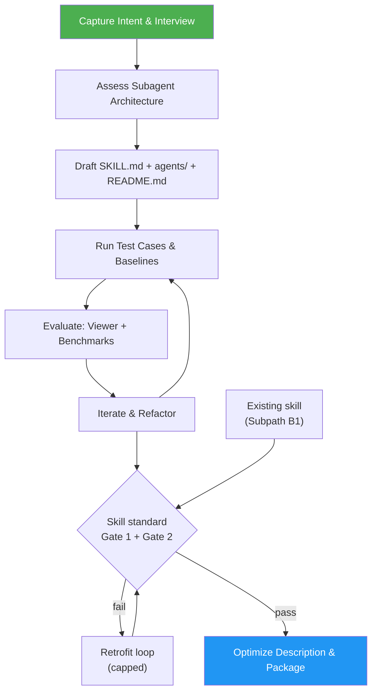

<!--
  DO NOT READ THIS FILE — This README.md is for human catalog browsing only.
  It ships inside the .skill package but is NEVER auto-loaded into agent context.
  The runtime loader only reads SKILL.md + references/ + scripts/ + agents/ when the skill triggers.
  If you're an AI agent, read the SKILL.md file instead for skill instructions.
-->

# Skill Creator

> Create agent skills, or bring existing ones up to the same standard — then evaluate, benchmark, and tune their triggering.

## Highlights

- One standard for created and updated skills: Gate 1 (`quick_validate.py`, frontmatter audit, size caps, five human-review checks) and Gate 2 (`asm eval` overall > 85, every category ≥ 8)
- Three ways to update a skill: B1 retrofit to the standard (default), B2 iterate on eval feedback, B3 opt-in delegation conversion
- B1 retrofit loop: baseline, `asm eval --fix`, Gate 1 fixes, lowest categories first, capped at 8 iterations; artifacts saved to `.asm-improver/` (`baseline.json`, `iter-N.json`, `report.md`)
- New skills close with the same check, so they ship publish-ready
- Iterative skill loop: draft, test prompts, evaluate, refine
- Controlled instructions: one action at a time, consistent terms, explicit conditions, and observable checks
- Human-review output contract: result, evidence, uncertainty, and required approval decisions
- Format selection by review task, including diagrams and interactive reports when they make inspection easier
- Understanding checks alongside correctness: find the result, separate assumptions, trace evidence, and identify the next decision
- Subagent architecture guidance: design skills that delegate heavy work to subagents, keeping the main agent lean
- Quantitative + qualitative eval workflow with baseline comparison
- Benchmark aggregation, variance analysis, and report tooling
- Description optimization flow to improve triggering accuracy
- Dedicated eval viewer and grading agents for structured review
- Dependency preflight: a skill that invokes other skills ships a gate naming each dependency, how to install it, and how to verify it
- Run stats on every create/update run: elapsed time, agents, skills, tool calls, plus tokens and cost where the host reports them

## When to Use

| Say this...                        | Skill will...                                                       |
| ---------------------------------- | ------------------------------------------------------------------- |
| "Create a skill for X"             | Interview you, draft SKILL.md + README.md, run test cases           |
| "Improve this skill"               | Retrofit it to the standard: baseline both gates, fix, loop, report |
| "Iterate on my eval results"       | Read feedback, revise, re-run evals into a new iteration            |
| "Run evals for my skill"           | Execute test prompts, grade results, show benchmark                 |
| "Optimize skill triggering"        | Generate trigger eval queries, run optimization loop                |
| "This skill is too slow / bloated" | Analyze for subagent refactoring opportunities                      |

## How It Works



## Installation

Install via [npx (Vercel)](https://www.npmjs.com/package/skills):

```bash
npx skills add https://github.com/luongnv89/skills --skill skill-creator
```

Or via [agent-skill-manager (asm)](https://www.npmjs.com/package/agent-skill-manager):

```bash
asm install github:luongnv89/skills:skills/skill-creator
```

## Requirements

Python 3 for `scripts/quick_validate.py`; `asm` on PATH for the Gate 2 score check. Without `asm`, Gate 2 is reported as not measured and a run never reports PASS.

## Usage

```
/skill-creator
/skill-creator skills/my-skill
```

## Resources

| Path                              | Description                                                                                                    |
| --------------------------------- | -------------------------------------------------------------------------------------------------------------- |
| `scripts/`                        | Eval loop, benchmarking, packaging, validation utilities                                                       |
| `references/`                     | Evals schema, subagent patterns, workflow patterns                                                             |
| `references/skill-standard.md`    | The two gates every created or updated skill clears                                                            |
| `references/retrofit-loop.md`     | Subpath B1 retrofit loop and the Path A closing check                                                          |
| `references/subagent-patterns.md` | Subagent architecture, plus per-step context delegation: a step names the `references/` slice its worker needs |
| `references/exemplars.md`         | Three annotated exemplars; the orchestrator one carries a per-step delegation trace                            |
| `eval-viewer/`                    | Generate/view review pages for eval results                                                                    |
| `agents/`                         | Analyzer, comparator, and grader agent prompts                                                                 |
| `assets/`                         | Viewer template assets                                                                                         |

## Output

Produces complete skill packages (SKILL.md + docs/README.md + agents/), eval results with benchmark reports, subagent restructuring recommendations, and optimized skill descriptions for accurate triggering. A retrofit or closing check writes `.asm-improver/` (baseline and per-iteration `asm eval` JSON, gate summaries, human-review and predictability audits, and `report.md`); `asm eval --fix` may leave `SKILL.md.bak` until you remove it.
