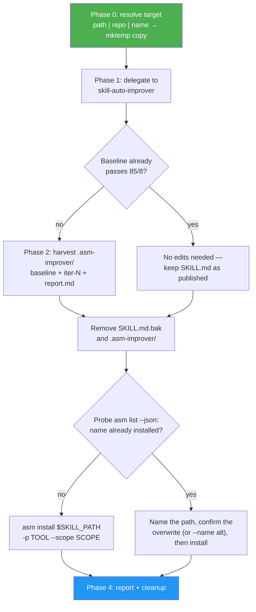

<!--
  DO NOT READ THIS FILE — This README.md is for human catalog browsing only.
  It ships inside the .skill package but is NEVER auto-loaded into agent context.
  The runtime loader only reads SKILL.md + references/ + scripts/ + agents/ when the skill triggers.
  If you're an AI agent, read the SKILL.md file instead for skill instructions.
-->

# Skill Install Improved

> Installs an **improved** variant of one skill instead of the published one. Resolves the target by local path, repo, or skill name; runs `skill-auto-improver` on a throwaway copy; installs the improved result; and reports what was installed and what it was improved from.

## Highlights

- **Three ways to name the target.** A local path, the repo it lives in, or just the skill name (resolved through `asm search --available`).
- **Your files are never touched.** Every input form — local paths included — is improved on a `mktemp -d` copy. An install should not rewrite your working tree or rebase your branch.
- **The improved copy is what gets installed**, not the original. `asm install` is pointed at the improved directory.
- **Provenance in the output.** The report names the identifier you supplied, the resolved install URL or clone URL, and the upstream commit SHA.
- **Before/after numbers.** Baseline vs final `overallScore` and grade, minimum category score, `metadata.version`, iterations taken, and files changed.
- **Honest about no-ops.** If the skill already clears the 85/8 floor, it installs the original unchanged and says so instead of faking a delta.
- **Collisions are caught before they happen.** `asm install` overwrites an existing same-named skill unconditionally and without a prompt, so the skill probes `asm list --json` first, names the path that would be replaced, and asks. `--name <alt>` is the documented opt-out, with a warning about duplicate triggers.

## When to Use

| Say this...                                        | Skill will...                                                    |
| -------------------------------------------------- | ---------------------------------------------------------------- |
| "Install code-review but improve it first"         | Resolve by name, improve on a copy, install the improved variant |
| "Install an improved version of this repo's skill" | Clone, improve, install                                          |
| "Install skills/foo, but level it up"              | Copy the local dir, improve the copy, install                    |
| "Improve skills/foo"                               | **Not this skill** — use `/skill-auto-improver`                  |
| "Send the improvement upstream as a PR"            | **Not this skill** — use `/skill-upstream-pr`                    |
| "Install code-review"                              | **Not this skill** — just run `asm install code-review`          |

## Usage

```
/skill-install-improved code-review
/skill-install-improved https://github.com/owner/repo
/skill-install-improved skills/my-skill
```

## How It Works



## What the Report Shows

| Field           | Example                                                        |
| --------------- | -------------------------------------------------------------- |
| Installed to    | `~/.claude/skills/code-review` (from install `--json` `.path`) |
| Tool / scope    | `claude` / `global`                                            |
| Install path    | confirmed overwrite of `~/.claude/skills/code-review`          |
| Supplied as     | `code-review`                                                  |
| Resolved from   | `github:owner/repo:skills/code-review`                         |
| Upstream commit | `a1b2c3d`                                                      |
| Overall score   | `71 (C) → 92 (A)`                                              |
| Min category    | `5 → 8`                                                        |
| Version         | `1.0.0 → 1.3.0`                                                |
| Iterations      | `3 of 8`                                                       |
| Files changed   | `SKILL.md`, `references/playbook.md`                           |

## Resources

| Path                                                                    | Description                                               |
| ----------------------------------------------------------------------- | --------------------------------------------------------- |
| [SKILL.md](../SKILL.md)                                                 | The agent workflow                                        |
| [references/target-resolution.md](../references/target-resolution.md)   | The three input forms normalized to one local directory   |
| [references/install-and-report.md](../references/install-and-report.md) | Install flags, collision policy, harvest fields, template |
| `skills/skill-auto-improver/`                                           | The improvement loop this skill delegates to              |
| `skills/skill-upstream-pr/`                                             | The sibling path for sending improvements upstream        |
