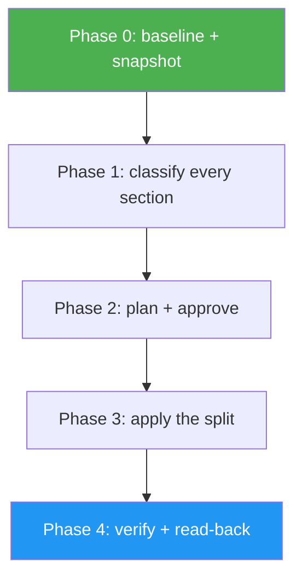

<!--
  DO NOT READ THIS FILE — This README.md is for human catalog browsing only.
  It ships inside the .skill package but is NEVER auto-loaded into agent context.
  The runtime loader only reads SKILL.md + references/ + scripts/ + agents/ when the skill triggers.
  If you're an AI agent, read the SKILL.md file instead for skill instructions.
-->

# Skill Shortener

> Shrink an over-long SKILL.md by progressive disclosure — and prove nothing was lost.

## Highlights

- **Measures before it cuts** — per-section line and word counts, plus the always-loaded / on-trigger / on-demand token split
- **Classifies every section** into KEEP, CUT, or MOVE, recorded in a manifest that becomes the loss-prevention record
- **Plans before it applies** — you approve the exact split before a single file is rewritten
- **Verifies mechanically** — 12 checks covering manifest exhaustiveness, dangling and orphaned pointers, reference chains, both size caps, and the version bump
- **Snapshots first**, because `~/.claude/skills/` is usually not a git repo

## When to Use

| Say this...                            | Skill will...                                                         |
| -------------------------------------- | --------------------------------------------------------------------- |
| "this SKILL.md is way too long"        | Measure it, propose a split, apply it on your go-ahead                |
| "shorten skill-x"                      | Run the full measure → classify → plan → apply → verify pass          |
| "what would you cut from this skill?"  | Audit-only mode: produce the plan and touch nothing                   |
| "apply progressive disclosure to this" | Move non-universal material into `references/` behind load conditions |

## How It Works



## Usage

```
/skill-shortener
```

## Resources

| Path                        | Description                                                           |
| --------------------------- | --------------------------------------------------------------------- |
| `references/`               | One file per disposition: what to keep, what to cut, where to move it |
| `scripts/measure_skill.py`  | Footprint and per-section size report, human-readable or JSON         |
| `scripts/verify_shorten.py` | The 12 post-split invariants, with a fix hint on every failure        |

## Output

A rewritten `SKILL.md` under the 500-line and 3000-word caps, new files under `references/` and `scripts/`, a bumped `metadata.version`, and a `.skill-shortener/` workdir holding the baseline, the manifest, and a timestamped snapshot of the original.
